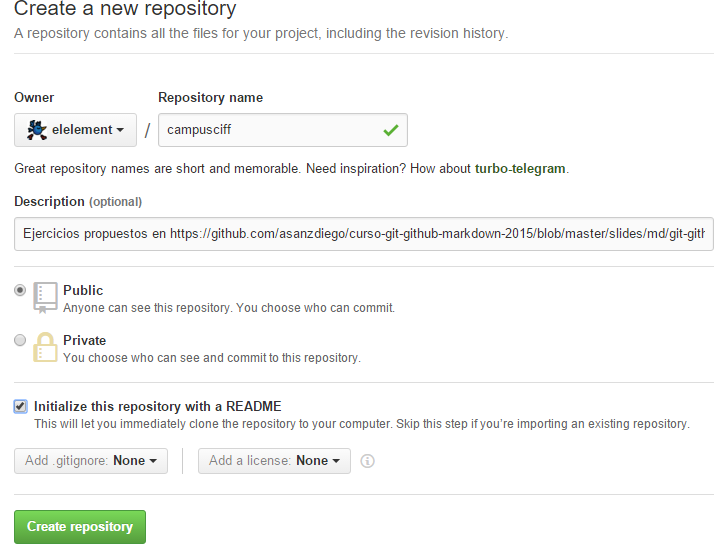

# campusciff
Ejercicios propuestos en https://github.com/asanzdiego/curso-git-github-markdown-2015/blob/master/slides/md/git-github-markdown-ejercicios.md

A continuación, se resuelven punto por punto cada uno de los apartados indicados.

## Repositorio campusciff (I)

### Crear un repositorio en vuestro GitHub llamado campusciff.
Para crear un repositorio, basta con iniciar sesión en nuestra cuenta de GitHub y pulsar sobre el botón 'Create repository' que se encuentra en el desplegable mostrado al pulsar sobre '+', en la esquina superior derecha. A continuación, introduciremos una descripción del proyecto (opcional).

En la imagen se aprecia con detalle la operación:



GitHub ofrece la posibilidad de crear directamente el fichero README desde la propia interfaz, por lo que aprovecharemos esta ayuda.
Es posible también añadir un fichero .gitignore, que servirá más tarde para que Git mantenga fuera del control de versiones los ficheros que le indiquemos.
Los repositorios pueden ser públicos o privados, siendo esta última opción de pago.

## Repositorio campusciff (II)

### Clonar vuestro repositio en local.
Para clonar el repositorio en nuestro ordenador y comenzar a trabajar utilizaremos el comando 'clone':
```bash
> git clone https://github.com/elelement/campusciff.git
```

### Commit inicial
En la siguiente imagen se aprecia mejor el flujo de trabajo que sigue Git:


Para subir los cambios de nuestra zona de trabajo al repositorio local, primero tendremos que añadirlos a la zona de 'staging', es decir, añadirlos al control de versiones (comando 'add'; aplicable a todos los ficheros que sean nuevos o que presenten cambios). A continuación, utilizaremos el comando 'commit' para confirmar dichos cambios en el repositorio (la sincronización con repositorios remotos es otra cuestión):
```bash
> git status
```

Nos muestra como efectivamente el fichero ha sido modificado por los cambios presentes hasta este punto respecto de la creación del fichero README.
```
C:\ejercicios_github\campusciff>git status
On branch master
Your branch is up-to-date with 'origin/master'.
Changes not staged for commit:
  (use "git add <file>..." to update what will be committed)
  (use "git checkout -- <file>..." to discard changes in working directory)

        modified:   README.md

Untracked files:
  (use "git add <file>..." to include in what will be committed)

        images/

no changes added to commit (use "git add" and/or "git commit -a")
```

Añadimos el fichero a la zona intermedia:
```bash
> git add .
> git status
```

Los ficheros ya se encuentan listos para ser publicados en el repositorio local:
```
C:\ejercicios_github\campusciff>git status
On branch master
Your branch is up-to-date with 'origin/master'.
Changes to be committed:
  (use "git reset HEAD <file>..." to unstage)

        modified:   README.md
        new file:   images/crear_repo.png
        new file:   images/git_status_unstaged.png
```

Finalmlente, realizamos el commit. La opción '-m', permite introducir un mensaje que describa el propósito del commit:
```bash
> git commit -m "commit inicial"
```

### Push inicial
Para sincronizar nuestros cambios con el repositorio remoto, tendremos que utilizar el comando 'push' sobre la rama que deseemos. En este caso sólo hay una, 'master', que se crea por defecto al crear el repositorio en Github.
```bash
> git push origin master
```

### Ignorar archivos (I)

1. Crear en el repositorio local un fichero llamado privado.txt:
```bash
touch privado.txt
```

2. Crear en el repositorio local una carpeta llamada privada.
```bash
mkdir privada
```

### Ignorar archivos (II)

Realizar los cambios oportunos para que tanto el archivo como la carpeta sean ignorados por git. Para ello, crearemos un fichero llamado '.gitignore' añadiendo las entradas a ignorar:
```bash
privada/
privado.txt
git add .gitignore
git commit -m "Añadido fichero .gitignore" .gitignore
```

### Añadir fichero 1.txt
```bash
type NUL > 1.txt
git add 1.txt
git commit -m- "Fichero 1.txt creado" 1.txt
```

### Creando etiquetas
Para crear una etiqueta o 'tag', utilizaremos el comando 'tag':

#### Tag v0.1
```bash
git tag -a v0.1 -m "Nuevo tag v0.1"
```


